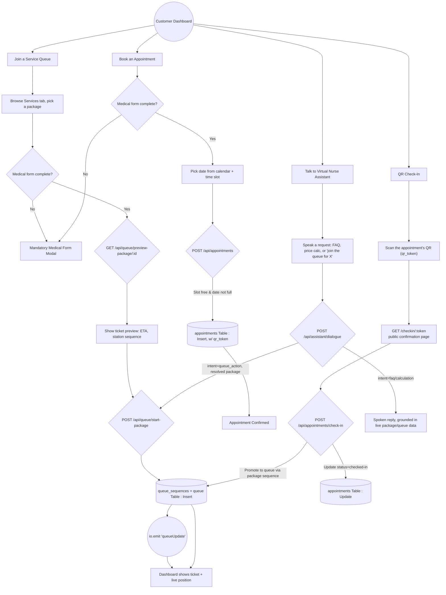
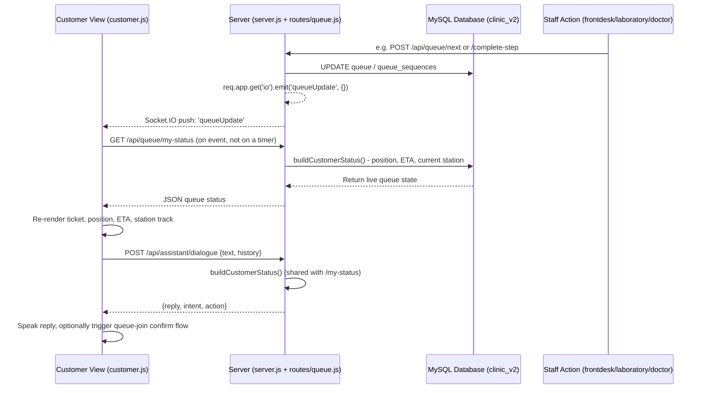

# Customer Side Flowchart & Data Flow Guide

This guide breaks down the customer operations within the Medical Clinic Queueing System. You can use these flowcharts to understand the user journey and the underlying data flow between the frontend and the database.

## 1. Registration & Authentication Flow

There is no separate `register.html`/`login.html` — everything happens in an auth-panel overlay on `index.html`. Registration is a 4-step wizard with OCR-assisted ID verification.

```mermaid
flowchart TD
    Start((Start)) --> IndexPage[index.html Landing Page]
    IndexPage -->|Sign In| LoginTab[Auth Overlay: Login Tab]
    IndexPage -->|Sign Up| RegTab[Auth Overlay: Register Tab]

    %% Registration Wizard (4 steps)
    RegTab --> Step1[Step 1: Upload Front/Back ID \nor Guardian Info if underage]
    Step1 --> SubmitStep1{POST /api/auth/register/step1}
    SubmitStep1 -->|OCR scan of ID| OCR[AI OCR Service \nfalls back to local mock]
    OCR -->|Detect category/name/birthday| PendingInsert[(pending_registrations : Insert)]
    PendingInsert --> Step2[Step 2: Create Password]
    Step2 --> SubmitStep2{POST /api/auth/register/step2}
    SubmitStep2 --> Step3[Step 3: Send Verification Code]
    Step3 --> SubmitStep3{POST /api/auth/register/send-verification}
    SubmitStep3 -->|Mock email w/ OTP| Step4[Step 4: Enter OTP]
    Step4 --> SubmitStep4{POST /api/auth/register/verify-otp}
    SubmitStep4 -->|Correct OTP| UserInsert[(users Table : Insert, category=Regular/Senior/PWD)]
    UserInsert --> RegSuccess[Registration Complete] --> LoginTab

    %% Login Form
    LoginTab --> InputCreds[Enter Username/Password]
    InputCreds --> SubmitLogin{POST /api/auth/login}
    SubmitLogin -->|Authenticate| DB_Check[(users Table : Query)]
    DB_Check -->|bcrypt compare + role lookup| GenToken[Generate JWT Token, 8h expiry]
    GenToken --> Redirect[Redirect by role: \ncustomer -> customer.html \nfrontdesk/laboratory/doctor -> their page \nadmin/admintechnical -> admintechnical.html \nowner -> owner.html]

    %% Error States
    SubmitLogin -->|Fail| ErrorMsg[Show Error Message]
    ErrorMsg --> LoginTab
```

---

## 2. Customer Dashboard & Core Actions Flow

Once logged in, the customer has three primary actions on their dashboard (`customer.html`), plus a voice-driven Virtual Nurse Assistant that can trigger the first and third.

---

## 3. Real-time Status Data Flow Diagram (DFD)

Live updates are push-based over Socket.IO, not client polling. Any staff action that mutates the queue emits a `queueUpdate` event; the customer dashboard listens and re-fetches its own status.

> [!TIP]
> **How to Use:** You can copy the code blocks from this markdown file into a Mermaid Live Editor (like [mermaid.live](https://mermaid.live/)) to export them as PNG/SVG images for your documentation or presentations.
