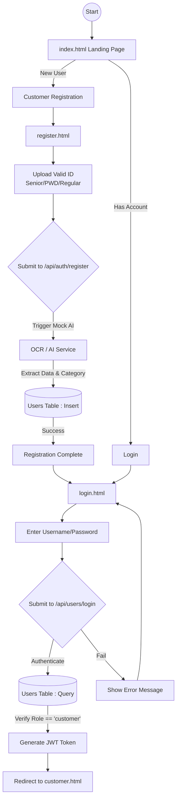
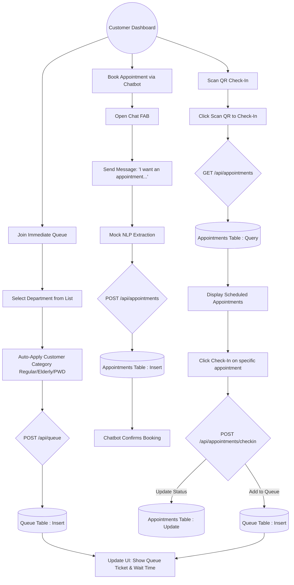
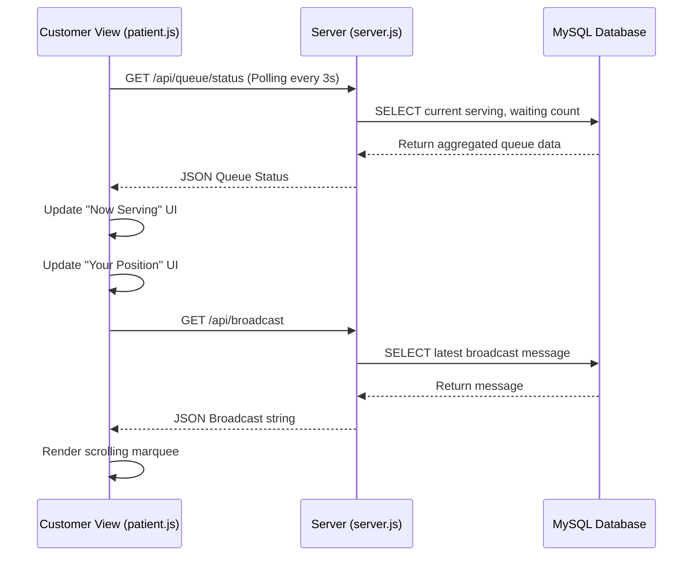

# Customer Side Flowchart & Data Flow Guide

This guide breaks down the customer operations within the Medical Clinic Queueing System. You can use these flowcharts to understand the user journey and the underlying data flow between the frontend and the database.

## 1. Registration & Authentication Flow

This diagram illustrates how a customer enters the system, registers with AI-assisted ID verification, and logs into their dashboard.

---

## 2. Customer Dashboard & Core Actions Flow

Once logged in, the customer has three primary actions they can perform on their dashboard (`customer.html`).

---

## 3. Real-time Status Data Flow Diagram (DFD)

This diagram focuses strictly on the data exchange (Data Flow Diagram - Level 1) when the customer is actively waiting in the queue.

> [!TIP]
> **How to Use:** You can copy the code blocks from this markdown file into a Mermaid Live Editor (like [mermaid.live](https://mermaid.live/)) to export them as PNG/SVG images for your documentation or presentations.
